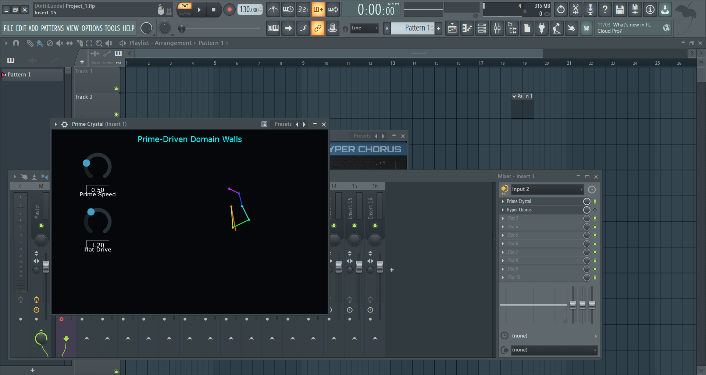

# Prime Crystal VST 🔺



*Forged in the void. Fueled by green alcohol. Driven by the irrationality of prime numbers.*

**Prime Crystal** is a real-time DSP audio effect—a living delay line and non-linear wavefolder built in C++ and JUCE. It does not use standard LFOs or rhythmic grids. Instead, it modulates audio using the incommensurable geometry of prime logarithms, continuously fracturing your sound without ever perfectly repeating.

## 🌌 The Inspiration

This plugin was built as an homage to the otherworldly, deep-space aesthetics of **Angine de Poitrine** and the geometry of **The Triangle**. It is an attempt to take the raw, chaotic, high-octane energy of "green alcohol" and crystallize it into functional, mathematical C++ architecture. 

We wanted to build an instrument that sounds like floating deep in space, watching code flow into your mind—a system where pure topology and quantum field mechanics crush and stretch audio into beautiful, shattered facets.

## 🧮 The Physics (How It Works)

Prime Crystal isn't built on standard audio algorithms; it is built on physics simulations:

1. **The Prime Driver (Incommensurate LFOs):** The delay taps are modulated by LFOs running at speeds proportional to the natural logarithms of the first six prime numbers: ln(2), ln(3), ln(5), ln(7), ln(11), ln(13). Because these numbers are rationally independent, the modulation never perfectly aligns. It creates an infinitely evolving, quasi-periodic interference pattern.

2. **The Substrate (Mexican Hat Saturation):** Instead of standard digital clipping, the feedback loop is passed through a "Mexican Hat" double-well potential equation: V(φ) = -Aφ² + Bφ⁴. This acts as a nonlinear wavefolder, physically pulling the audio tails toward stable mathematical vacua and adding deep, harmonic grit.

3. **The Dirichlet Spiral (UI):** The visualizer on the right side of the plugin is not a random animation. It is the real-time mathematical rendering of the Riemann arm—the rotating prime vectors tracking the simulation time t along the critical line.

## 🎧 Installation (For Musicians)

If you just want to drop the crystal into your DAW and make noise:

1. Download the compiled `Prime Crystal.vst3` from the Releases tab.
2. Place the file into your system's VST3 folder:
   - Windows: C:\Program Files\Common Files\VST3
3. Open your DAW (e.g., FL Studio, Ableton) and scan for new plugins.
   - Note for FL Studio users: If the plugin doesn't show up immediately, go to the Plugin Manager, check "Verify plugins" and "Rescan plugins with errors", then hit "Find installed plugins".
4. Turn down your volume, put on headphones, and feed it a signal.

## 🛠️ Building from Source (For Developers)

If you want to compile the universe yourself, you will need CMake (3.22+) and a C++ compiler (like Visual Studio 2022 Community with "Desktop development with C++" installed).

### 1. Set Up the Directory

```bash
git clone https://github.com/juce-framework/JUCE.git
```

Ensure the JUCE folder is in the same directory as your CMakeLists.txt file.

### 2. Generate the Build Files

```bash
cmake -B build
```

### 3. Compile the Plugin

```bash
cmake --build build --config Release
```

## ⚠️ CRITICAL WINDOWS COMPILATION NOTES

- Run as Administrator: You MUST run your Developer Command Prompt as an Administrator, or you will get a Permission denied error at the end of the build.

- Close Your DAW: Make sure FL Studio (or any other DAW) is completely closed. If a DAW is holding the old .vst3 file in memory, Windows will lock the file and block the compiler from overwriting it.

---

Created by PerceptionLab / Antti Luode.
